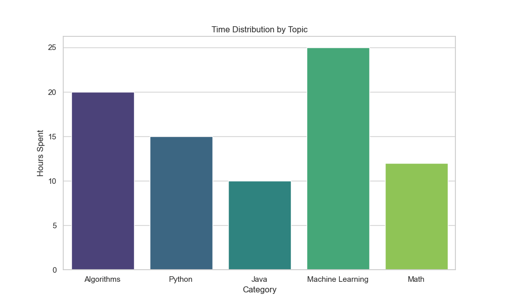

# Data Analysis & Technical Visualization
*A Python-based workflow for processing structured data and generating visual insights.*

## 🚀 Overview
This repository serves as a public portfolio for my data processing engine. It demonstrates my ability to take complex **JSON** data and transform it into clear, professional visualizations using Python. This project highlights my dual interest in technical implementation and clear communication.

## ✨ Technical Focus
* **Programming:** Python-driven data manipulation using **Pandas**.
* **Data Structures:** Implementation of logic based on **Algorithms and DBMS** concepts.
* **Visualization:** High-fidelity plotting using **Seaborn** and **Matplotlib**.
* **AI/ML:** Integration of concepts like **Machine Learning** and model analytics.

## 📊 Sample Output
The following chart was generated by the private source code to visualize time distribution across technical domains:

## 🏅 Recognition & Writing
* **First Prize Winner:** Article Writing Competition organized by **IEEE SIGHT AG JECC**.
* I specialize in bridging the gap between complex code and readable documentation.

## 📅 Featured Project: One-Tap Campus Event Hub
**Technologies:** Python, Google Calendar API, JSON

In addition to data visualization, I developed a functional backend script to automate campus event management.
* **API Integration:** Successfully implemented Google Calendar API for automated event scheduling.
* **Secure Data Handling:** Managed OAuth2 flows and secure token storage locally.
* **Automation:** Streamlined the process of turning event lists into calendar invites.

Here its is,

## 🎯 Project Spotlight: "One-Tap" Campus Event Hub

### ⚠️ The Problem
College fests and workshops are often missed because students don't see the physical posters, leading to missed opportunities for networking and career growth.

### ✅ My Solution
I built a "One-Tap" Campus Event Hub using Python. This tool bridges the gap between event organizers and students by:
* Automating event scheduling via the **Google Calendar API**.
* Providing a centralized hub for all campus workshops and fests.
* Reducing the reliance on physical posters and ensuring real-time updates.

